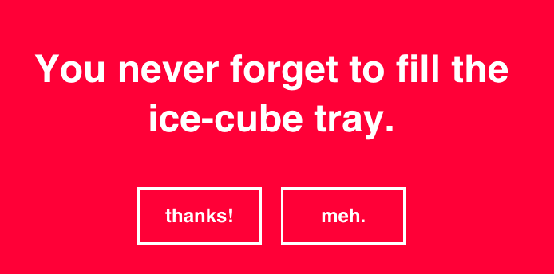

## WDI Pick-Me-Up



You have been tasked with creating your own version of [Emergency Compliment](http://emergencycompliment.com/), except with  WDI-themed compliments. When a user visits the site, they should be greeted with a WDI-themed compliment to cheer them up.

### Learning Objectives

  - Practice serving static & templated content using Rails

### Setup
You will need to set up the Rails app, including the routes, controllers, models, and views.

Create new app:
```
# in terminal
rails new emergency_compliment --database=postgresql
```

Create a database:
```
rails db:create
```

Generate the Compliment model:
```
rails generate model Compliment text:string
```

Run the migration
```
rails db:migrate
```
Add compliments to your `db/seeds.rb` file, and run
```
rails db:seed
```

Set up routes - example:
```
# in config/routes.rb
get "/", to: "compliments#index"
get "/:name", to: "compliments#show"
```

Set up controller - example:
```
# in terminal
rails g controller compliments


# inside the compliments controller
def index
end

def show
end
```

Set up views folder structure - example:
```
- views/
  - layouts/
  - compliments/
    - index.html.erb
    - show.html.erb
```

#### Completion

Completion for tonight's assignment is to get through part 6.

#### Useful Rsources

- [Rails Docs](http://guides.rubyonrails.org/index.html)

#### Part 1: Generate and Serve a Generic Compliment

When you visit the root (`"/"`) of your app, it should render the `index` view and display:
- a generic greeting
- a randomly chosen compliment (you'll need to write the logic in your controller in the `def index` method to randomly select a compliment from your database of compliments)
- an achor (`<a>`) tag that links back to the root (`"/"`) and displays the text `"I'm still emotionally unfulfilled. Give me another compliment!"`
- another anchor tag, but this one displaying the text `"I'm ready to soldier on."`, and takes the user to the Ruby docs when clicked.

#### Part 2: Personalized Compliment

When you visit `"/:name"` (ie: `"/stefan"`), the greeting should personalize itself to the provided name. There should still be a random compliment. (`HINT` - use params!)

> Greetings Stefan, Your fingers are magic on the keys...

#### Part 3: New Compliment

Add this to `config/routes.rb`
```
resources :compliments, except: [:index, :show]
get "/", to: "compliments#index"
get "/:name", to: "compliments#show"
```
Now you have routes to `:create`, `:edit`, and `:delete` a compliment, so go ahead and build methods in your `compliments_controller` to allow us to add a new compliment to our compliments database. You'll probably need some kind of _helper_ for the  _form for_ your new compliment, or at least some kind of _view_ for it... 

#### Part 4: Update a Compliment

Do what you did above to add a compliment, but now make it so that you can update an existing compliment. 

#### Part 5: Delete a Compliment

Inside of your edit form, [create a button](http://api.rubyonrails.org/classes/ActionView/Helpers/UrlHelper.html#method-i-button_to) that hits the delete route for a compliment, to delete it from the database. (Some of those compliments _are_ a little backhanded...) 

#### Part 6: Layouts

Use a layout for the erb's so that there is a nice banner at the top of the page in the browser.

#### Bonus

#### Part 7: Make It Look Good

Style really hard with css.

#### Part 8: Randomize Background Color

Make it so that anytime the page is loaded or refreshed, the background color changes.


#### Related Readings

- **HTTP and Networking**
  + [Simple HTTP Definition](http://simple.wikipedia.org/wiki/Hypertext_Transfer_Protocol)
  + [More Complex HTTP Description](http://www.jmarshall.com/easy/http/)
  + [Simple Client-Server Definition](http://simple.wikipedia.org/wiki/Client-server)
- **Rails**
  + [Documentation](http://guides.rubyonrails.org/index.html)
